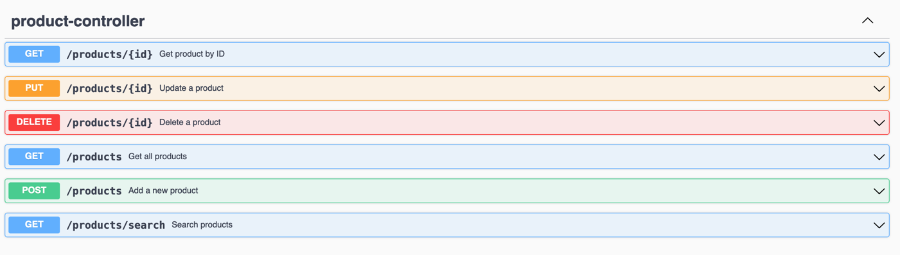

# microservice_product

---

### Setup project : 

- Créer un .env à la racine du projet avec la variable d'environnement suivante : 

```properties
SPRING_DATA_MONGODB_URI=lien vers la db mongo distante
```

- Lancer le projet avec la commande suivante : 

```shell
docker compose up
```


Puis rendez-vous sur [http://localhost:8080/swagger-ui.html](http://localhost:8080/swagger-ui.html) pour tester les différentes routes de l'API.
